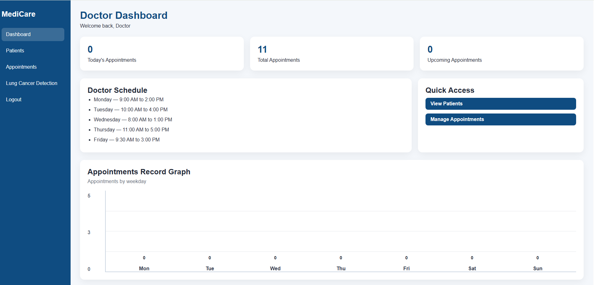
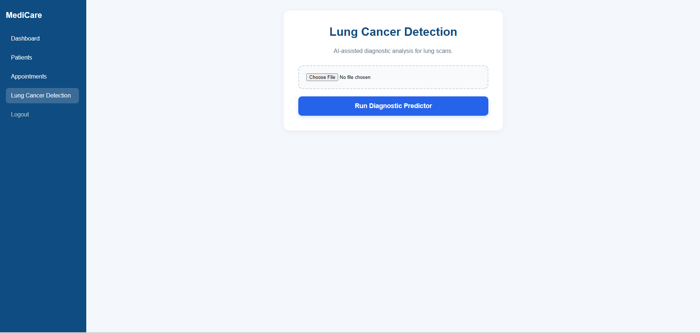
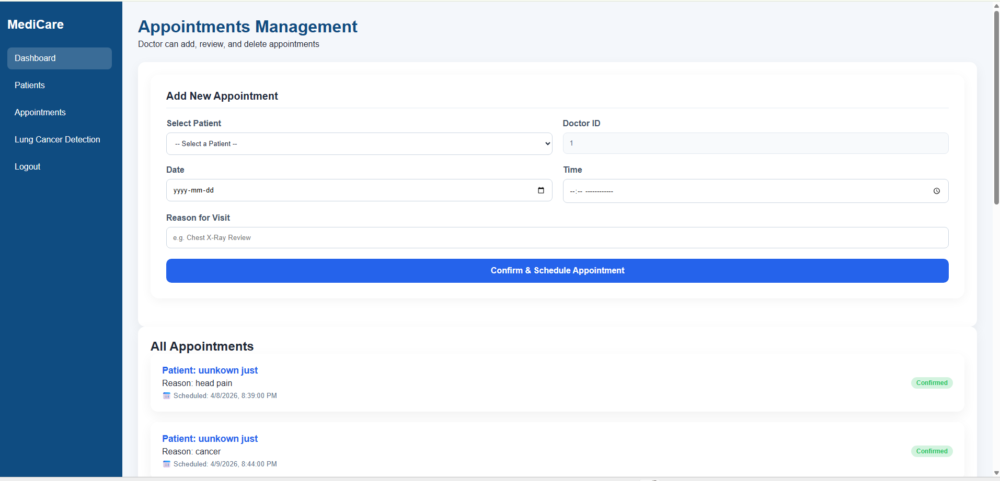
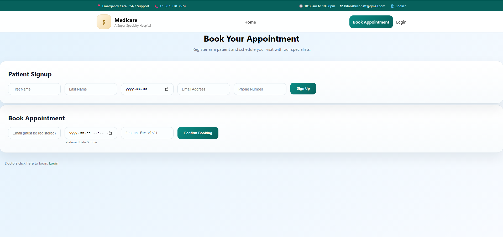

# LungVision Pro — AI-Powered Lung Cancer Detection System

> An end-to-end clinical web application that combines deep learning–based lung scan classification with a full patient management and appointment booking system — built for real-world hospital workflows.

---

## Overview

LungVision Pro is a full-stack medical web application that lets doctors upload CT/X-ray lung scans and receive an AI-generated diagnosis in seconds. Under the hood, an EfficientNet-B0 model trained on labeled lung imaging data classifies scans into four categories: adenocarcinoma, large cell carcinoma, squamous cell carcinoma, or normal.

The project is not just an ML demo. It ships with a complete hospital workflow: patient registration, appointment scheduling, a doctor dashboard with live statistics, and a public-facing booking portal — all wired to a relational MySQL database through a FastAPI REST backend.

This was built as a capstone project to demonstrate how machine learning can be integrated into a usable clinical tool, rather than left as a Jupyter notebook.

---

## Features

- **AI Lung Scan Classifier** — EfficientNet-B0 model fine-tuned on 4-class lung cancer dataset, served via a FastAPI `/predict-lung-cancer` endpoint
- **Real-time Confidence Scoring** — Returns prediction label and softmax probability percentage per scan
- **Doctor Dashboard** — Live stats for today's appointments, total appointments, and upcoming bookings; includes a weekday bar chart built without any chart library
- **Appointment Management** — Full CRUD: doctors can schedule, view, and cancel appointments linked to real patient records
- **Patient Registration** — Doctors register patients with full medical profile including DOB, conditions, allergies, gender, and address
- **Public Booking Portal** — Patients can self-register and book appointments directly without a login
- **Doctor Auth System** — Secure signup and login with SHA-256 password hashing; role-based access control separating Doctor and Patient flows
- **Responsive UI** — Mobile-aware layouts across all pages

---

## Tech Stack

| Layer | Technology |
|---|---|
| **ML Model** | PyTorch, EfficientNet-B0 (torchvision), Softmax classification |
| **Backend** | Python, FastAPI, Uvicorn, aiomysql, mysql-connector-python |
| **Frontend** | Vanilla HTML, CSS, JavaScript (no framework) |
| **Database** | MySQL |
| **Data Processing** | Pillow, NumPy, scikit-image, OpenCV |
| **Auth** | SHA-256 password hashing, localStorage session |
| **Model Training** | PyTorch, Adam optimizer, CrossEntropyLoss, torchvision transforms |
| **Dev Tools** | Python virtualenv, Git |

---

## Architecture

```
┌─────────────────────────────────────────────┐
│              Frontend (HTML/JS/CSS)          │
│  index.html → book_appointments.html         │
│  login.html → home.html (Doctor Dashboard)   │
│  patients.html → appointments.html           │
│  detection.html (AI scan uploader)           │
└────────────────┬────────────────────────────┘
                 │ REST API (fetch / FormData)
                 ▼
┌─────────────────────────────────────────────┐
│              FastAPI Backend (main.py)       │
│                                             │
│  /login            → auth + role check      │
│  /signup           → doctor registration    │
│  /register-patient → patient creation       │
│  /get-appointments → JOIN query w/ names    │
│  /add-appointment  → availability check     │
│  /predict-lung-cancer → ML inference        │
└──────────┬───────────────────┬──────────────┘
           │                   │
           ▼                   ▼
   ┌──────────────┐   ┌────────────────────┐
   │  MySQL DB    │   │  ML Inference Layer│
   │  LungCancer  │   │  EfficientNet-B0   │
   │  - users     │   │  model_loader.py   │
   │  - patients  │   │  lung_prediction   │
   │  - appts     │   │  _service.py       │
   └──────────────┘   └────────────────────┘
```

**ML Pipeline:** An image uploaded through `detection.html` is sent as multipart form data to `/predict-lung-cancer`. The service loads the pre-trained `.pth` model once at startup, applies the same normalization transforms used during training (`mean=[0.485, 0.456, 0.406]`, `std=[0.229, 0.224, 0.225]`), runs inference with `torch.no_grad()`, and returns the argmax label plus confidence percentage.

**Training Pipeline:** `training/train.py` fine-tunes EfficientNet-B0 (pretrained on ImageNet) by replacing the final linear classifier with a 4-class output head. Training uses data augmentation (random flip, random rotation), Adam optimizer at `lr=0.001`, and runs for 20 epochs. The saved `.pth` file is loaded by the backend at runtime.

---

## Screenshots

> _Screenshots below reflect the actual application pages._

**Doctor Dashboard**


**Lung Cancer Detection Page**


**Appointments Management**


**Homepage**


**Public Booking Portal**


---

## Installation & Setup

### Prerequisites

- Python 3.10+
- MySQL Server running locally
- Node.js (optional, only if modifying frontend tooling)
- A trained model file: `backend/models/lung_cancer_model.pth`

### 1. Clone the repository

```bash
git clone https://github.com/HitanshuBhatt/Cancer_detection.git
cd Cancer_detection
```

### 2. Set up the Python environment

```bash
python -m venv venv

# Windows
venv\Scripts\activate

# macOS/Linux
source venv/bin/activate

pip install -r backend/requirements.txt
```

### 3. Configure the database

Create a MySQL database named `LungCancer` and run your schema migrations. Update the credentials in `backend/main.py` if your MySQL setup differs from the defaults:

```python
DB_CONFIG = {
    "host": "localhost",
    "user": "root",
    "password": "your_password",
    "database": "LungCancer"
}
```

### 4. Add the trained model

Place your trained model file at:

```
backend/models/lung_cancer_model.pth
```

To train from scratch using your own dataset:

```bash
# Expects dataset at: Datasets/train and Datasets/validation
# Subfolders named: adenocarcinoma, large_cell_carcinoma, normal, squamous_cell_carcinoma

python training/train.py
```

### 5. Start the backend

```bash
cd backend
uvicorn main:app --reload
```

The API will be available at `http://127.0.0.1:8000`. You can explore all endpoints at `http://127.0.0.1:8000/docs`.

### 6. Open the frontend

Open `frontend/index.html` in your browser directly, or serve it with any static file server:

```bash
cd frontend
python -m http.server 5500
```

Then navigate to `http://localhost:5500`.

---

## Usage

### As a Patient (Public Portal)
1. Open `book_appointments.html`
2. Fill in the Patient Signup form to register
3. Use the Booking form with your registered email to schedule an appointment

### As a Doctor
1. Register at `signup.html` (role defaults to `Doctor`)
2. Log in at `login.html`
3. You are redirected to the Doctor Dashboard (`home.html`)
4. Navigate to **Patients** to register new patients or search existing ones
5. Navigate to **Appointments** to manage scheduling
6. Navigate to **Lung Cancer Detection**, upload a lung scan image, and click **Run Diagnostic Predictor** to receive an AI prediction

---

## Project Structure

```
Cancer_detection/
├── backend/
│   ├── main.py                         # FastAPI app, all routes, CORS, DB config
│   ├── database.py                     # MySQL connection helper
│   ├── requirements.txt
│   └── app/
│       ├── api/
│       │   └── prediction_routes.py    # /predict-lung-cancer endpoint
│       ├── ml/
│       │   └── model_loader.py         # EfficientNet-B0 loader, weight injection
│       └── services/
│           └── lung_prediction_service.py  # Image transform + inference logic
├── frontend/
│   ├── index.html                      # Public landing page
│   ├── login.html / login.js           # Doctor authentication
│   ├── signup.html / signup.js         # Doctor registration
│   ├── home.html / home.js             # Doctor dashboard + stats chart
│   ├── patients.html / patients.js     # Patient management + registration form
│   ├── appointments.html / appointments.js  # Appointment scheduling + display
│   ├── detection.html / detection.js   # AI scan uploader + result display
│   └── book_appointments.html          # Public patient portal
└── training/
    ├── train.py                        # Full EfficientNet fine-tuning pipeline
    ├── lung_model.py                   # Prototype training script
    └── test.py                         # CUDA availability check
```

---

## Key Learnings & Highlights

**Integrating ML into a web product:** The biggest challenge was bridging PyTorch inference with a live web request. Getting the image preprocessing pipeline in `lung_prediction_service.py` to exactly match the training transforms in `train.py` (same resize, same normalization constants) was critical — a mismatch here tanks model accuracy silently.

**EfficientNet fine-tuning:** Rather than building a CNN from scratch, I replaced only the final classifier layer of a pretrained EfficientNet-B0. This gave strong results with limited training data and compute because the feature extractor weights from ImageNet already encode low-level visual patterns useful for medical imaging.

**FastAPI over Flask:** Switching to FastAPI gave async route support (useful for the aiomysql signup flow), automatic request validation via Pydantic models, and free OpenAPI docs at `/docs` — which made testing every endpoint much faster.

**Async/sync mixing:** The appointment booking routes use synchronous `mysql-connector` while signup uses `aiomysql`. This was a conscious trade-off made while iterating — a future refactor would standardize on one async driver throughout.

**No JS framework:** The entire frontend is vanilla HTML/CSS/JS. This kept the project portable and forced a solid understanding of the DOM, fetch API, and FormData — skills that translate directly into React or Vue work.

---

## Model Performance

| Metric | Value |
|---|---|
| Architecture | EfficientNet-B0 (pretrained ImageNet) |
| Output Classes | 4 (adenocarcinoma, large cell carcinoma, normal, squamous cell carcinoma) |
| Training Epochs | 20 |
| Optimizer | Adam (lr=0.001) |
| Loss Function | CrossEntropyLoss |
| Input Size | 224 × 224 px |

> _Validation accuracy metrics will be added once full evaluation runs are completed on the holdout set._

---

## Future Improvements

- **Grad-CAM Heatmaps** — Overlay activation maps on the scan image to show the doctor which region of the lung the model focused on, improving clinical interpretability
- **JWT Authentication** — Replace localStorage session with a proper token-based auth system
- **PostgreSQL Migration** — Move from MySQL to PostgreSQL for better JSON support and scalability
- **Docker Compose** — Containerize the backend, database, and frontend for one-command deployment
- **Test Coverage** — Add pytest unit tests for the ML service and integration tests for API routes
- **Patient History** — Link past scan results and appointment history to each patient profile
- **Email Notifications** — Send appointment confirmation emails via SMTP on booking

---


_Built by [Hitanshu Bhatt](https://github.com/HitanshuBhatt) — Computer Programming Diploma, Red Deer Polytechnic | AWS Certified_
